# Titanic Dataset Exploratory Data Analysis Report

This report presents a structured exploratory data analysis of the Titanic passenger list to uncover patterns, trends, and key factors that influenced survival rates.

---

## Executive Summary

The analysis of 891 passengers on the Titanic confirms that survival was not random but strongly influenced by demographic and socio-economic factors. 
- The overall survival rate was **38.38%** (342 survivors out of 891).
- **Gender** was the single most dominant factor: females had a **74.20%** survival rate compared to just **18.89%** for males.
- **Socio-economic class (Pclass)** was another critical determinant: passengers in 1st Class had a **62.96%** survival rate, while 3rd Class passengers had only **24.24%**.
- **Family structure** played a role: passengers traveling in small families (2–4 members) survived at significantly higher rates (55%–72%) than individuals traveling alone (30%) or in large families (0%–20%).
- **Imputation strategy**: Missing ages were imputed based on titles extracted from names, providing a more robust estimation than a global median.

---

## 1. Dataset Overview & Data Quality

The dataset contains information about 891 passengers with 12 characteristics.

| Column | Non-Null Count | Data Type | Description |
| :--- | :--- | :--- | :--- |
| PassengerId | 891 | Integer | Unique identifier for each passenger |
| Survived | 891 | Integer | Target: 0 = Deceased, 1 = Survived |
| Pclass | 891 | Integer | Passenger Class: 1st, 2nd, 3rd |
| Name | 891 | String | Passenger's full name (includes titles) |
| Sex | 891 | String | Gender (male / female) |
| Age | 714 (891 imputed) | Float | Age of passenger |
| SibSp | 891 | Integer | Number of siblings/spouses aboard |
| Parch | 891 | Integer | Number of parents/children aboard |
| Ticket | 891 | String | Ticket number |
| Fare | 891 | Float | Fare paid |
| Cabin | 204 | String | Cabin number (highly sparse) |
| Embarked | 889 (891 imputed) | String | Port of embarkation (S, C, Q) |

### Missing Value Treatment
- **Age**: Imputed using the median age of the passenger's specific title (e.g., `Mr`, `Mrs`, `Miss`, `Master`). This prevents general skewing (e.g., assigning a child's age to an adult male).
- **Embarked**: Imputed the 2 missing records with `S` (Southampton), the dataset mode.
- **Cabin**: Missing in 77% of rows. Instead of dropping, we engineered a binary feature `HasCabin` (1 if cabin is recorded, 0 if null) to test if cabin assignment correlates with survival.

---

## 2. Univariate Analysis (Distributions)

### Survival Rate
Out of 891 passengers, 549 deceased and 342 survived. This yields a baseline survival rate of approximately **38.4%**.

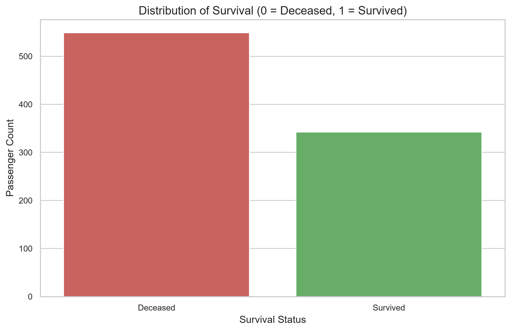

### Passenger Class (Pclass)
The majority of passengers were in 3rd Class (491 passengers), followed by 1st Class (216) and 2nd Class (184).

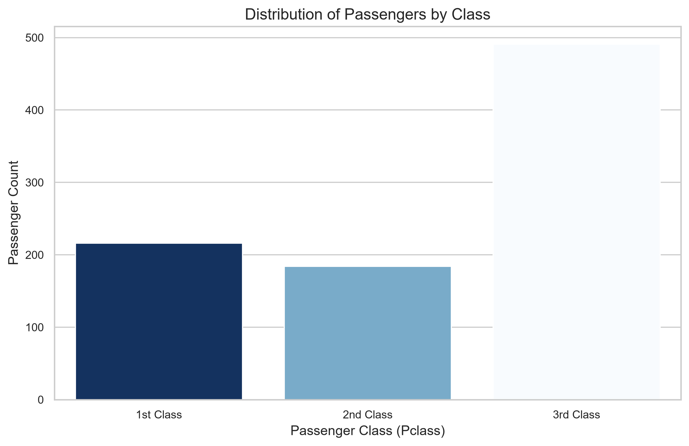

### Gender Distribution
The dataset is skewed towards male passengers, representing about 65% of the total (577 males vs. 314 females).

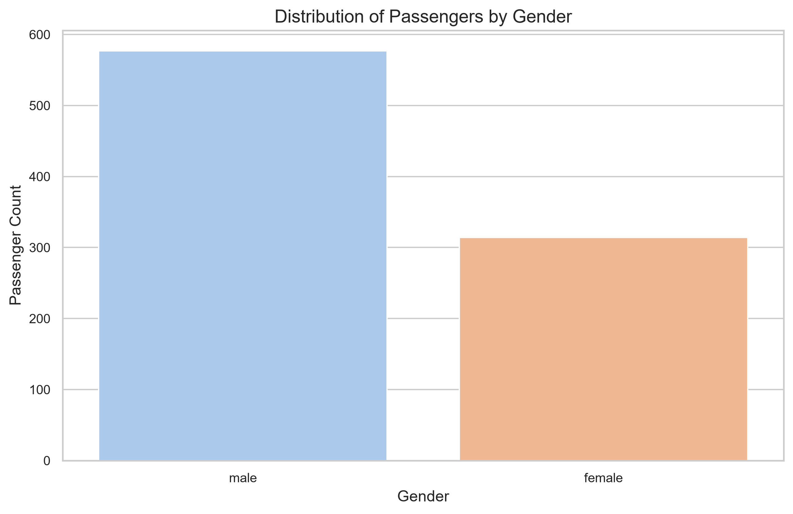

### Age & Fare Distributions
- **Age**: The distribution peaks around 20–30 years, with a secondary peak representing infants.
- **Fare**: Highly right-skewed, indicating most passengers paid cheap ticket fares, while a few paid extremely high premiums (up to £512).

````carousel
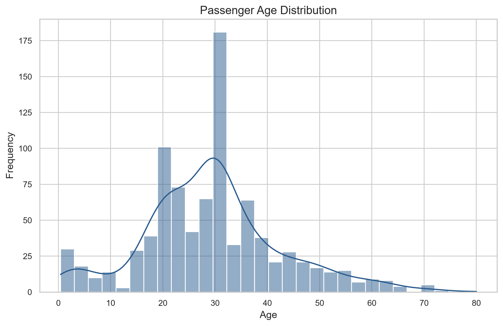
<!-- slide -->
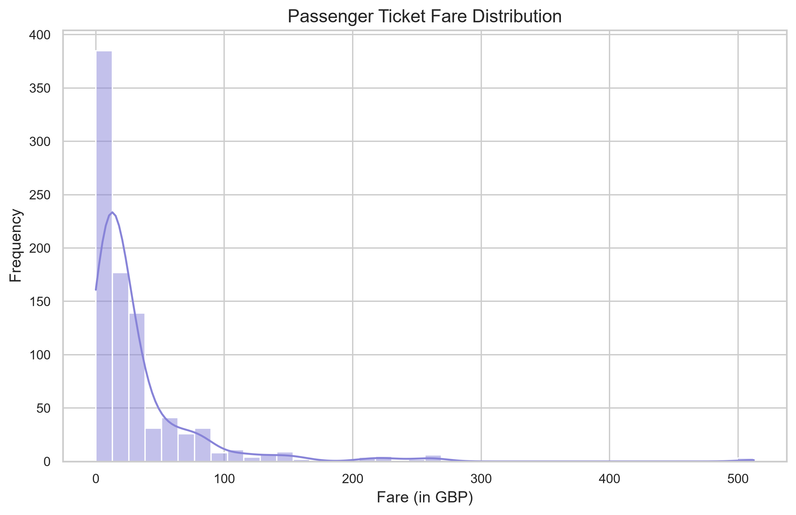
````

---

## 3. Bivariate & Multivariate Analysis (Survival Drivers)

### Gender and Socio-Economic Class

Gender and Class are the strongest predictors of survival.
- **Women First**: Female passengers had an overwhelming survival rate of **74.2%**, compared to only **18.9%** of males, confirming the historical "women and children first" policy.
- **Class Privilege**: 1st Class passengers were highly favored, with **62.96%** survival. 3rd Class passengers suffered the highest casualty rate, with only **24.24%** surviving.

````carousel
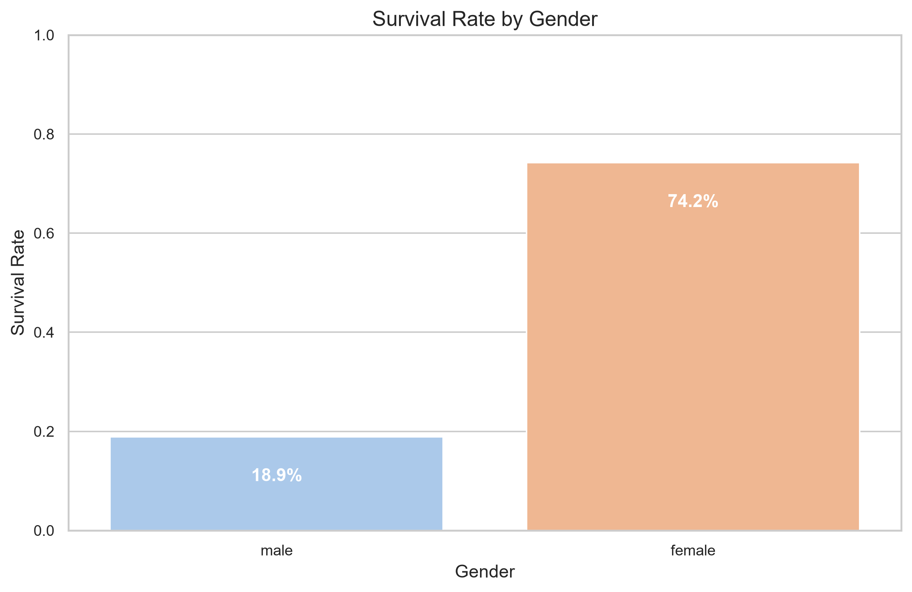
<!-- slide -->
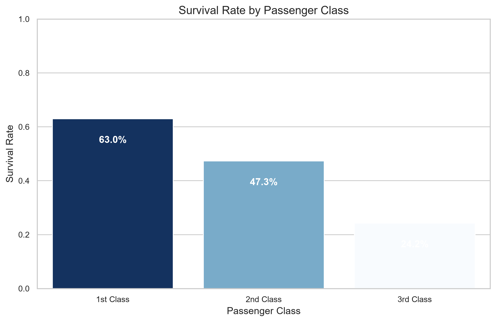
````

When combined, we observe that even inside 1st Class, males had a low survival rate compared to females, but a 1st Class male had a significantly higher chance of survival (~36.9%) than a 3rd Class male (~13.5%). 3rd Class females had a ~50% survival rate, indicating class lowered survival rates even for women.

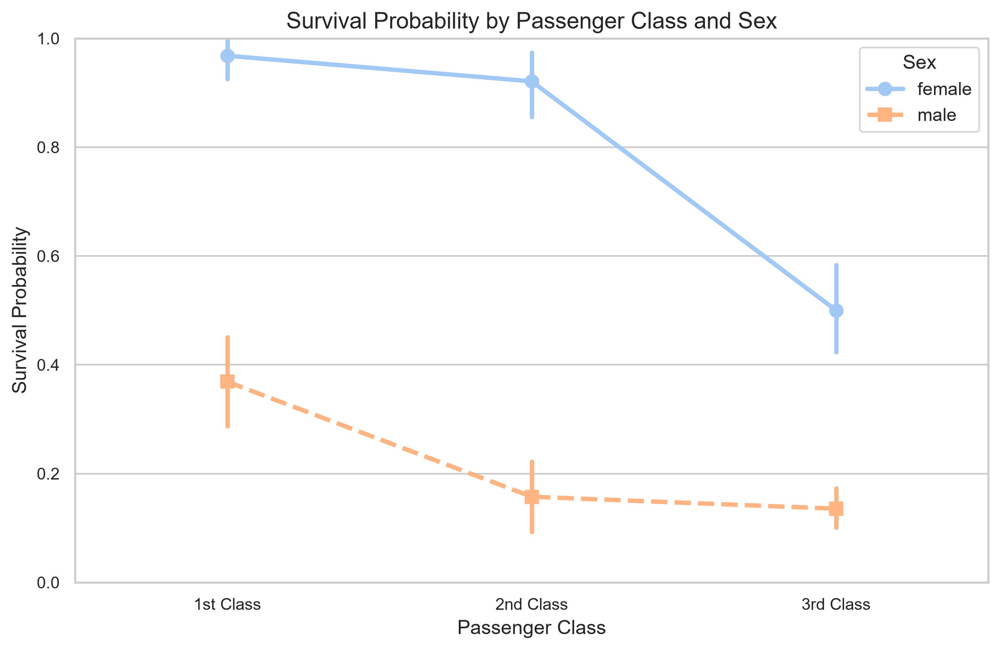

---

### Age and Passenger Titles

- **Children**: The Age KDE plot below shows a distinct peak in survival for young children (aged 0–10).
- **Social Title**: The engineered `Title` feature clarifies survival dynamics:
  - Married women (`Mrs`) survived at **79.37%**.
  - Unmarried women (`Miss`) survived at **70.27%**.
  - Young boys (`Master`) survived at **57.50%**.
  - Adult men (`Mr`) had a very low survival rate of **15.67%**.

````carousel
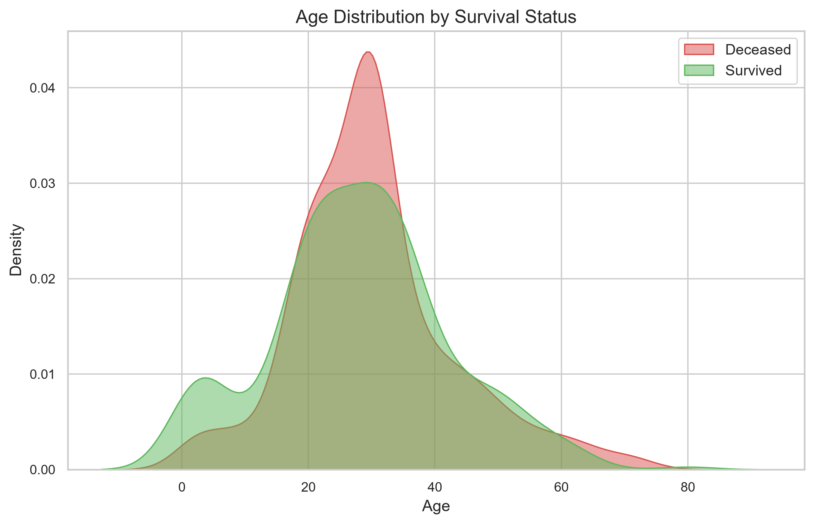
<!-- slide -->
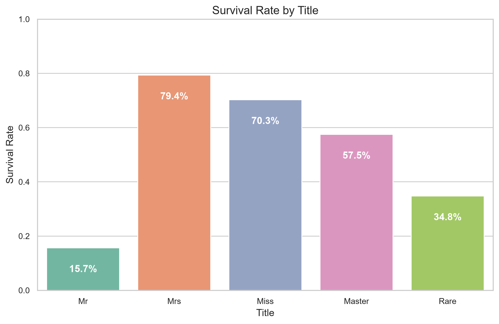
````

---

### Family Size and Cabin Allocation

- **Family Size**: Passengers traveling alone (`FamilySize = 1`) had a survival rate of **30.35%**. Those traveling in small families (2 to 4 people) had the highest survival rate, peaking at **72.41%** for families of 4. Large families (5+) had very low survival rates because coordination during evacuation was extremely difficult.
- **Cabin Recording**: Passengers with a cabin number recorded (`HasCabin = 1`) had a **66.67%** survival rate, compared to **29.99%** for those without. This correlates strongly with class placement, as cabins were primarily assigned to upper-deck 1st and 2nd class passengers.

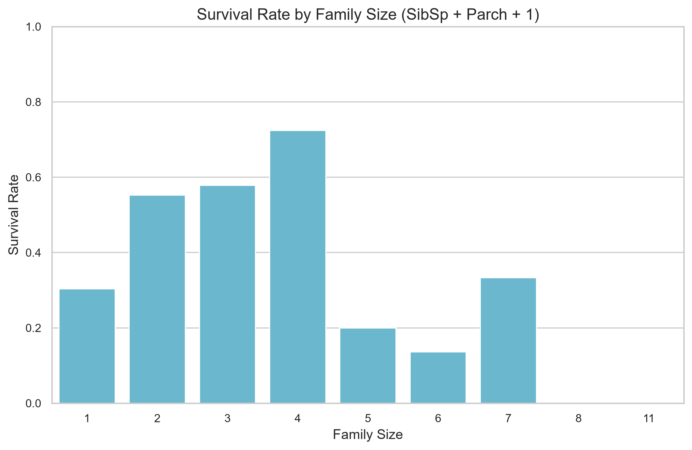

---

## 4. Correlation Analysis

A Pearson correlation matrix was calculated using the encoded categorical variables:
- `Sex_encoded` (0 = Male, 1 = Female)
- `Embarked_encoded` (0 = Southampton, 1 = Cherbourg, 2 = Queenstown)

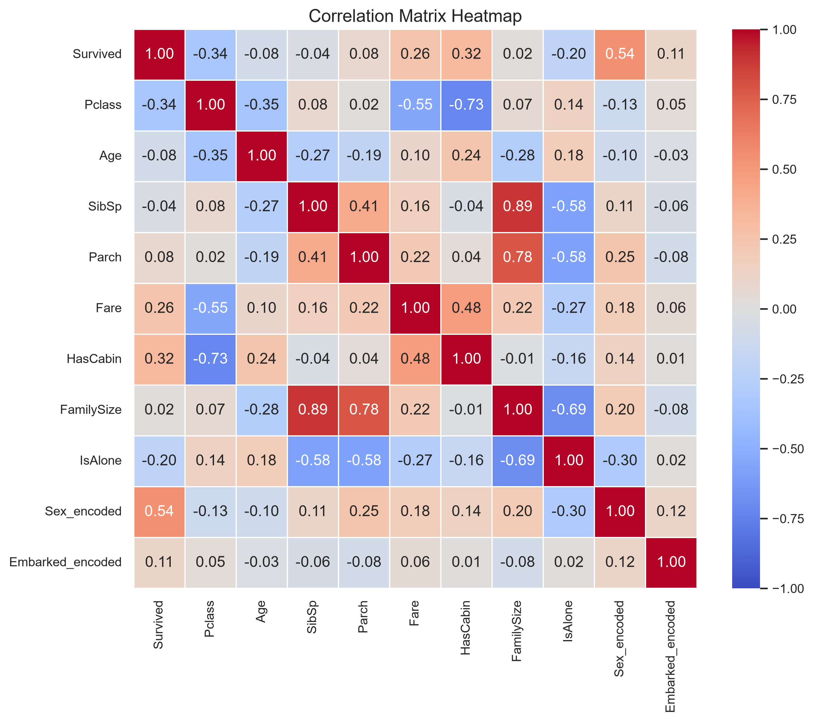

### Key Insights from Heatmap:
1. **Sex and Survival**: The strongest positive correlation with survival is `Sex_encoded` (\(r = 0.54\)), confirming females were far more likely to survive.
2. **Pclass and Survival**: Strong negative correlation (\(r = -0.34\)) showing that survival rates drop as we move from 1st to 3rd class.
3. **Cabin and Survival**: Strong positive correlation of `HasCabin` with survival (\(r = 0.32\)) and strong negative correlation with `Pclass` (\(r = -0.73\)), proving cabin recording is a proxy for 1st-class ticket holders.
4. **IsAlone and FamilySize**: `IsAlone` is negatively correlated with survival (\(r = -0.20\)), supporting the theory that single travelers did worse than small families.

---

## 5. Structured Insights & Analytical Takeaways

> [!IMPORTANT]
> ### Key Driving Factors for Survival
> 1. **Demographics (Gender/Age)**: "Women and Children First" was heavily enforced. Young boys (`Master`) had significantly higher survival rates than adult men (`Mr`).
> 2. **Socio-Economic Stratification (Class/Fare)**: Cabin location and class determined proximity to lifeboats and early warning access. 1st class passengers had cabins on upper decks and direct access.
> 3. **Social and Familial Support**: Traveling in small groups (2–4 people) increased chances of survival, likely due to cooperative assistance, whereas large groups struggled to stay together, and single travelers lacked immediate assistance.

> [!NOTE]
> ### Data Cleaning Notes
> The imputation of `Age` using the median value grouped by `Title` successfully preserved age structures across sub-populations, yielding more realistic demographic distributions than a simple mean or median replacement.
